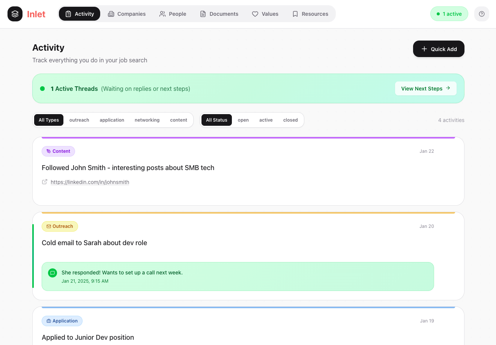
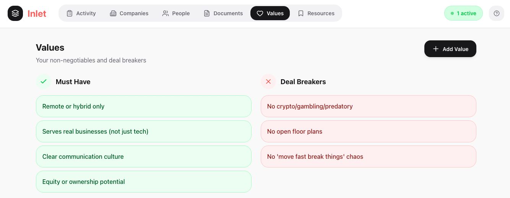

# Inlet

**The Job Hunt CRM that keeps you sane.**



## 🌊 What is Inlet?

**Inlet** is a local-first Personal Relationship Manager (PRM) designed specifically for the modern job search.

Standard spreadsheets are messy, and generic CRMs are too bloated. Inlet sits in the sweet spot: it tracks your **outreach**, manages your **network**, and—most importantly—filters every opportunity through your personal **Values**.

It is built to run locally on your machine, giving you complete ownership of your data with zero latency.

---

## 🚀 Key Features

### 1. Activity Feed & Pipeline

Stop wondering _"Did I follow up with Sarah?"_. The Activity Feed treats your job hunt like a sales pipeline.

- **Track Everything:** Log applications, cold outreach, networking calls, and content creation.
- **Status Tracking:** Mark threads as `Active`, `Waiting`, or `Closed`.
- **Quick Add:** Rapidly log new tasks without breaking your flow.

### 2. Values-Driven filtering

Most job trackers only care about _getting_ the job. Inlet helps you decide if you _want_ it.

- Define your **Must Haves** (e.g., Remote, Equity).
- Define your **Deal Breakers** (e.g., No open floor plans).
- Evaluate companies against this "North Star" before applying.



### 3. Network & Documents

- **People:** Link contacts to specific companies and track interaction history.
- **Documents:** Manage versions of your Resumes, Cover Letters, and Portfolios in one place.

---

## 🛠 Tech Stack

- **Frontend:** React + Vite
- **Backend:** JSON-Server (Local REST API)
- **Process Management:** PM2 (Keeps client + server alive in background)
- **Styling:** CSS Modules / Styled Components
- **Icons:** Lucide React

---

## ⚡️ Quick Start

This project uses **PM2** to manage the frontend and backend simultaneously in the background.

### 1. Installation

```bash
git clone [https://github.com/josdic1/inlet.git](https://github.com/josdic1/inlet.git)
cd inlet/client
npm install
```
