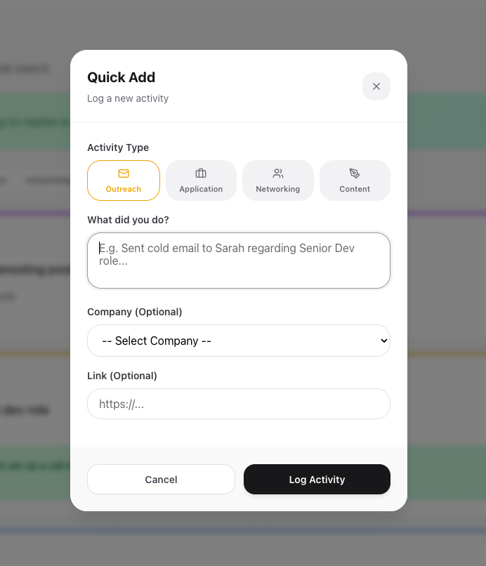
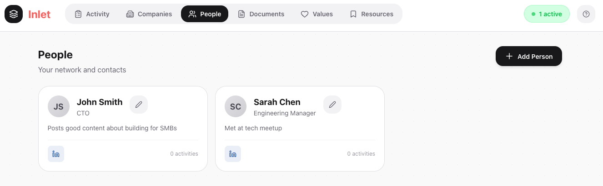
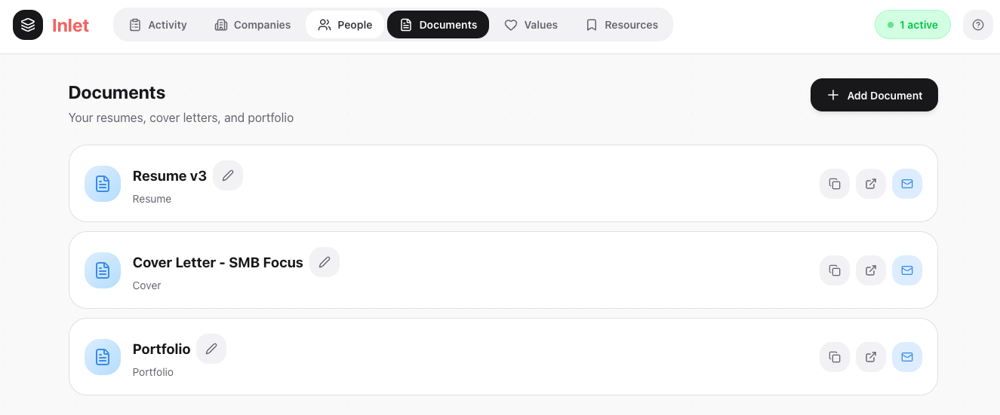

# Inlet

**Your job search command center.**

A clean, focused web app for tracking every touchpoint in your job search — from cold outreach to final offers. Built for people who want to stay organized without drowning in spreadsheets.

<p align="center">
  
</p>

---

## The Problem

Job searching is chaos. You're juggling LinkedIn messages, cold emails, applications, networking events, and follow-ups across dozens of companies. Most people use sprawling spreadsheets that become unmanageable within weeks.

## The Solution

Inlet gives you one place to log everything with minimal friction:

- **Quick Add** — Log any activity in seconds with type, note, company, and link
- **Touch System** — When someone responds, hit "touch" to bump that thread to the top and track the conversation
- **Active Threads** — See exactly what's in motion and needs your attention
- **Filter Views** — Slice your activity by type (outreach, application, networking, content) or status (open, active, closed)

---

## Features

<table>
<tr>
<td width="50%">

### Activity Feed
The heart of the app. Every action you take lives here with timestamps, categorization, and full history.

</td>
<td width="50%">

### Quick Add Modal
Friction-free logging. Select type, write what you did, optionally link a company — done.

</td>
</tr>
<tr>
<td>

</td>
<td>

</td>
</tr>
</table>

<table>
<tr>
<td width="50%">

### People
Track your network and contacts. See related activities at a glance.

</td>
<td width="50%">

### Documents
Your resumes, cover letters, and portfolio links. One-click copy, open, or email.

</td>
</tr>
<tr>
<td>

</td>
<td>

</td>
</tr>
</table>

<p align="center">
  
</p>

### Values
Your non-negotiables and deal breakers. Reference these when evaluating opportunities.

---

## Tech Stack

| Layer | Technology |
|-------|------------|
| Frontend | React 18, React Router, Vite |
| State | Context API with custom hooks |
| Styling | Pure CSS (no frameworks) |
| Backend | JSON Server (development) / Express (production-ready) |
| Icons | Lucide React |

---

## Architecture

```
client/src/
├── components/       # Reusable UI components
│   ├── ActivityCard.jsx
│   ├── QuickAddModal.jsx
│   ├── TouchModal.jsx
│   ├── ActiveBanner.jsx
│   └── NavBar.jsx
├── pages/            # Route-level components
│   ├── ActivityPage.jsx
│   ├── CompaniesPage.jsx
│   ├── PeoplePage.jsx
│   ├── DocumentsPage.jsx
│   ├── ValuesPage.jsx
│   └── ResourcesPage.jsx
├── contexts/         # React Context definitions
├── providers/        # Context providers with business logic
├── hooks/            # Custom hooks (useAuth, useData)
└── index.css         # All styles in one file
```

---

## Getting Started

### Prerequisites
- Node.js 18+
- npm or yarn

### Installation

```bash
# Clone the repo
git clone https://github.com/yourusername/inlet.git
cd inlet

# Install dependencies
cd client && npm install

# Start the development server
npm run dev
```

### Running with Backend

```bash
# In a separate terminal, start JSON Server
cd server
npx json-server --watch db.json --port 3000
```

---

## Data Model

```javascript
{
  activities: [{
    id, type, note, link,
    personId, companyId, documentIds,
    status, created, touches: [{ date, note }]
  }],
  people: [{ id, name, role, companyId, link, notes }],
  companies: [{ id, name, tier, link, notes }],
  documents: [{ id, name, link, type }],
  values: [{ id, text, type }],  // type: "good" | "bad"
  resources: [{ id, name, link, lastEngaged, notes }]
}
```

---

## Key Patterns

**Context-Based State Management**
All data flows through a single AuthProvider that handles fetching, caching, and CRUD operations. Components consume via `useAuth()` hook.

**URL-Driven Filters**
Activity filters sync to URL params (`/?type=outreach&status=active`), making views shareable and bookmarkable.

**Touch Mechanic**
When someone responds to your outreach, the "touch" action:
1. Adds a timestamped note to the activity
2. Changes status to "active"
3. Bumps the item to the top of the feed

---

## License

MIT

---

<p align="center">
  <strong>Built by <a href="https://josdic1.github.io/demberry.com/">Josh Dicker</a></strong><br>
  <em>Click 👆 to see more of my apps!</em>
</p>
