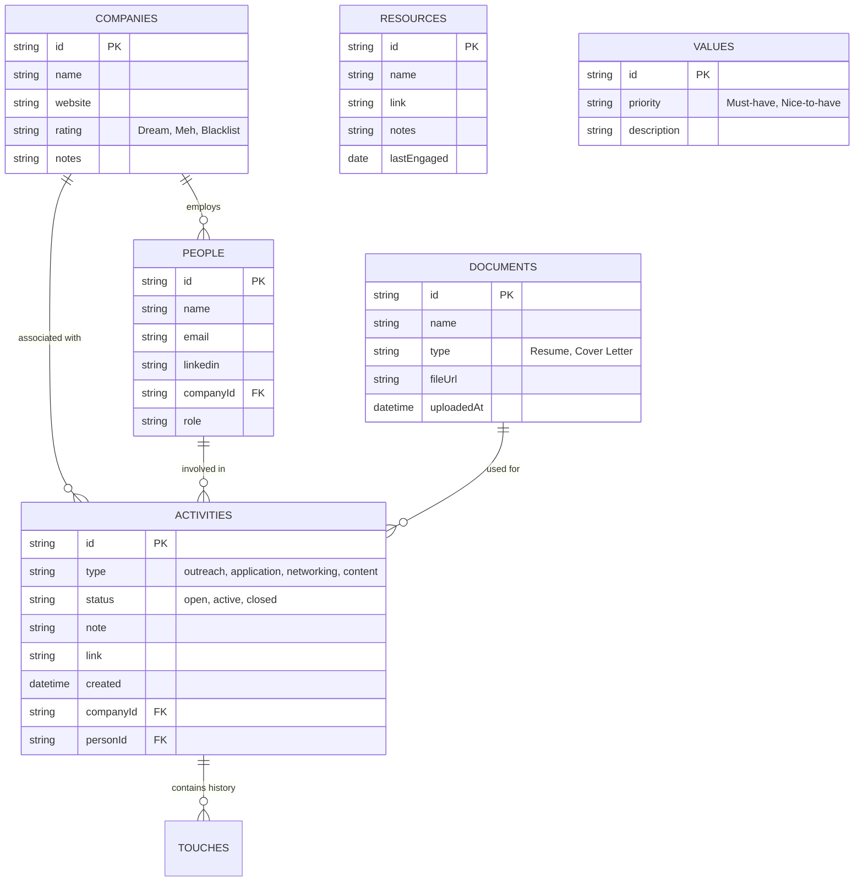

```mermaid
erDiagram
    COMPANIES ||--o{ PEOPLE : "employs"
    COMPANIES ||--o{ ACTIVITIES : "associated with"
    PEOPLE ||--o{ ACTIVITIES : "involved in"
    ACTIVITIES ||--o{ TOUCHES : "contains history"
    DOCUMENTS ||--o{ ACTIVITIES : "used for"

    ACTIVITIES {
        string id PK
        string type "outreach, application, networking, content"
        string status "open, active, closed"
        string note
        string link
        datetime created
        string companyId FK
        string personId FK
    }

    COMPANIES {
        string id PK
        string name
        string website
        string rating "Dream, Meh, Blacklist"
        string notes
    }

    PEOPLE {
        string id PK
        string name
        string email
        string linkedin
        string companyId FK
        string role
    }

    DOCUMENTS {
        string id PK
        string name
        string type "Resume, Cover Letter"
        string fileUrl
        datetime uploadedAt
    }

    RESOURCES {
        string id PK
        string name
        string link
        string notes
        date lastEngaged
    }

    VALUES {
        string id PK
        string priority "Must-have, Nice-to-have"
        string description
    }
```